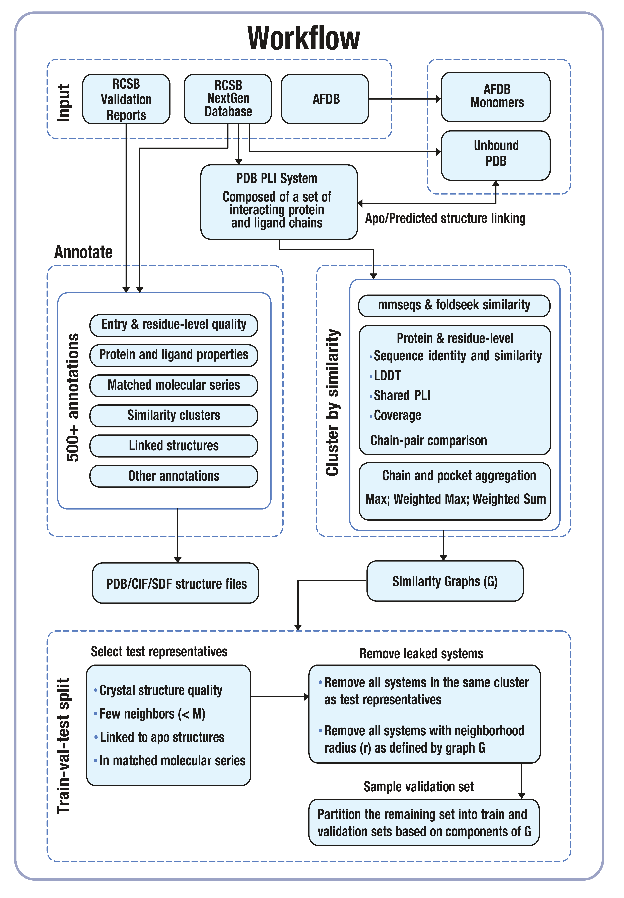

# Pipeline

We outline conceptually the steps of the end-to-end pipeline in the following sections.
We briefly describe some of the abstractions that are used to orchestrate the entire
pipeline, but they are to be considered an implementation detail because they rely
on our choice of orchestration framework for job execution.

## Ingestion

The code to obtain the raw data sources used in `plinder` are housed
in the `plinder.data.pipeline.io` package and are invoked in our
end-to-end pipeline through task wrappers in `plinder.data.pipeline.tasks`.

- `tasks.download_rcsb_files`: uses the RCSB rsync API to download the majority of the raw data

  - This is a distributed task that is called in parallel for chunks of two character codes
  - It syncs both the next-gen `cif.gz` and validation `xml.gz` files for all entries
  - Side effects include writing the following files:
    - `ingest/{two_char_code}/{full_pdb_id}/{full_pdb_id}-enrich.cif.gz`
    - `reports/{two_char_code}/{pdb_id}/{pdb_id}_validation.xml.gz`

- `tasks.download_alternative_datasets`: download all the alternative datasets used to enrich `plinder`
  - This is a task that is called once but reaches out to numerous external REST APIs
  - This could be threaded and arguably the alphafold sync could be its own task
  - Side effects include writing the following files:
    - `dbs/alphafold/AF-{uniprod_id}-F1-model_v4.cif`
    - `dbs/cofactors/cofactors.json`
    - `dbs/components/components.parquet`
    - `dbs/ecod/ecod.parquet`
    - `dbs/kinase/kinase_information.parquet`
    - `dbs/kinase/kinase_ligand_ccd_codes.parquet`
    - `dbs/kinase/kinase_uniprotac.parquet`
    - `dbs/kinase/kinase_structures.parquet`
    - `dbs/panther/panther_{i}.parquet`
    - `dbs/seqres/pdb_seqres.txt.gz`

## Database creation

Once the raw data is downloaded, we need to create the `foldseek` and `mmseqs`
databases to be used as a basis for the similarity datasets.

- `tasks.make_dbs`: creates the `foldseek` and `mmseqs` databases
  - This is a task that is called once
  - It uses the `cif.gz` data to create the `foldseek` database
  - It uses the `pdb_seqres.txt.gz` data to create the `mmseqs` database (obtained in `download_alternative_datasets`)

## Annotation generation

Once the raw data is downloaded, we can start generating the annotation data.
Technically, this could run in parallel with the database creation, but it this task
is already heavily distributed and it would add complexity to the DAG.

- `tasks.make_entries`: creates the `raw_entries` data
  - This is a distributed task that is called in parallel for chunks of PDB IDs
  - It uses the `cif.gz` and `xml.gz` data in `Entry.from_cif_file`
  - It additionally uses the following alternative datasets:
    - `ECOD`
    - `Panther`
    - `Kinase`
    - `Cofactors`
    - `Components`
  - Side effects include writing the following files:
    - `raw_entries/{two_char_code}/{pdb_id}.json`
    - `raw_entries/{two_char_code}/{system_id}/**`

## Structure quality checks

After raw annotation generation, we run a series of quality checks
on the generated data and do some consolidation and organization
of the generated data.

- `tasks.structure_qc`: runs the structure quality checks
  - This is a distributed task that is called in parallel for chunks of two character codes
  - It reads in the JSON files in `raw_entries`
  - Side effects include writing the following files:
    - `qc/index/{two_char_code}.parquet` - consolidated annotations
    - `qc/logs/{two_char_code}_qc_fails.csv` - list of entries that failed QC
    - `entries/{two_char_code}.zip` - zipped JSON entries

## Structure archives

The amount of structural data generated in `make_entries` is large and consolidated
separately in its own task.

- `tasks.make_system_archives`: creates the structure archives
  - This is a distributed task that is called in parallel for chunks of two character codes
  - It consolidates the structure files into zip archives in the same layout as for `entries`
  - The inner structure of each structure zip is grouped by system ID
  - Side effects include writing the following files:
    - `archives/{two_char_code}.zip` - zipped structure files

## Ligand Similarity

Once the `plinder` systems have been generated by `make_entries`, we can enumerate
the small molecule ligands in the dataset.

- `tasks.make_ligands`: creates the `ligands` data
  - This is a distributed task that is called in parallel for chunks of PDB IDs
  - It filters out ligands that are acceptable for use in ligand similarity
  - It uses the JSON files from `raw_entries`
  - Side effects include writing the following files:
    - `ligands/{chunk_hash}.parquet`
- `tasks.compute_ligand_fingerprints`: computes the ligand fingerprints
  - This is a task that is called once
  - It uses the `ligands` data
  - Side effects include writing the following files:
    - `fingerprints/ligands_per_inchikey.parquet`
    - `fingerprints/ligands_per_inchikey_ecfp4.npy`
    - `fingerprints/ligands_per_system.parquet`
- `tasks.make_ligand_scores`: creates the `ligand_scores` data
  - This is a distributed task that is called in parallel for chunks of ligand IDs
  - It uses the `fingerprints` data
  - Side effects include writing the following files:
    - `ligand_scores/{fragment}.parquet`

## Sub-databases

Once the `plinder` systems have been generated, we are able to split the `foldseek`
and `mmseqs` databases into sub-databases containing `holo` and `apo` systems. We additionally use the alphafold linked_structures
to create the `pred` sub-database.

- `tasks.make_sub_dbs`: creates the `holo` and `apo` sub-databases
  - This is a task that is called once
  - It uses the `foldseek` and `mmseqs` databases
  - Side effects include writing the following files:
    - `dbs/subdbs/holo_foldseek/**`
    - `dbs/subdbs/apo_foldseek/**`
    - `dbs/subdbs/pred_foldseek/**`
    - `dbs/subdbs/holo_mmseqs/**`
    - `dbs/subdbs/apo_mmseqs/**`
    - `dbs/subdbs/pred_mmseqs/**`

## Protein similarity

With the `holo` and `apo` sub-databases created, we can run
protein similarity scoring for all `plinder` systems.

- `tasks.run_batch_searches`: runs the `foldseek` and `mmseqs` searches for large batches

  - This is a distributed task that is called in parallel for large chunks of PDB IDs
  - It uses the JSON files from `raw_entries` and the `holo` and `apo` sub-databases
  - Side effects include writing the following files:
    - `foldseek` and `mmseqs` search results

- `tasks.make_batch_scores`: creates the protein similarity scores
  - This is a distributed task that is called in parallel for smaller chunks of PDB IDs
  - It uses the JSON files from `raw_entries` and the `foldseek` and `mmseqs` search results
  - Side effects include writing the following files:
    - `scores/search_db=holo/*`
    - `scores/search_db=apo/*`
    - `scores/search_db=pred/*`

## MMP and MMS

- `tasks.make_mmp_index`: creates the `mmp` dataset
  - This is a task that is called once
  - It additionally consolidates the `index` dataset created in `structure_qc` into a single parquet file
  - Side effects include writing the following files:
    - `mmp/plinder_mmp_series.parquet`
    - `mmp/plinder_mms.csv.gz`

## Clustering

Once the protein similarity scores are generated, we run
component and community clustering.

- `tasks.make_components_and_communities`: creates the `components` and `communities` clusters for given metrics at given thresholds
  - This is a distributed task that is called in parallel for individual tuples of metric and threshold
  - It uses the protein similarity scores and the annotation index
  - Side effects include writing the following files:
    - `clusters/**`

## Splits

Armed with the clusters from the previous step, we can now split the `plinder` systems into `train`, `test` and `val`.

## Leakage

With splits in hand, we perform an exhaustive evaluation of the generated splits
to quantify the quality of the splits through leakage metrics.

# Technical details

## Schemas

The `scores` protein similarity dataset is a collection of
parquet files with the following schema:

    >>> from plinder.data.schemas import PROTEIN_SIMILARITY_SCHEMA
    >>> PROTEIN_SIMILARITY_SCHEMA
    query_system: string
    target_system: string
    protein_mapping: string
    mapping: string
    protein_mapper: dictionary<values=string, indices=int8, ordered=0>
    source: dictionary<values=string, indices=int8, ordered=1>
    metric: dictionary<values=string, indices=int8, ordered=1>
    similarity: int8

The `ligand_scores` ligand similarity dataset is a collection of
parquet files with the following schema:

    >>> from plinder.data.schemas import TANIMOTO_SCORE_SCHEMA
    >>> TANIMOTO_SCORE_SCHEMA
    query_ligand_id: int32
    target_ligand_id: int32
    tanimoto_similarity_max: int8

The `clusters` clustering dataset is a collection of
parquet files with the following schema:

    >>> from plinder.data.schemas import CLUSTER_DATASET_SCHEMA
    >>> CLUSTER_DATASET_SCHEMA
    metric: string
    directed: bool
    threshold: int8
    system_id: string
    component: string

The `splits` split datasets are independent
parquet files with the following schema:

    >>> from plinder.data.schemas import SPLIT_DATASET_SCHEMA
    >>> SPLIT_DATASET_SCHEMA
    system_id: string
    split: string
    cluster: string
    cluster_for_val_split: string

The `linked_structures` datasets are independent
parquet files with the following schema:

    >>> from plinder.data.schemas import STRUCTURE_LINK_SCHEMA
    >>> STRUCTURE_LINK_SCHEMA
    query_system: string
    target_system: string
    protein_qcov_weighted_sum: float
    protein_fident_weighted_sum: float
    pocket_fident: float
    target_id: string
    sort_score: float
