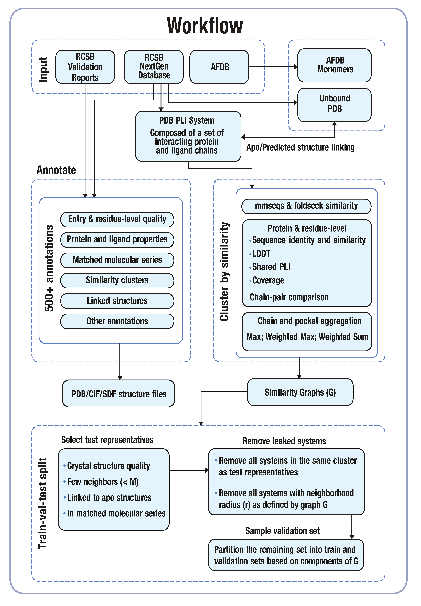

# Pipeline

We outline conceptually the steps of the end-to-end pipeline in the following sections.
We briefly describe some of the abstractions that are used to orchestrate the entire
pipeline, but they are to be considered an implementation detail because they rely
on our choice of orchestration framework for job execution.



## Ingestion

The code to obtain the raw data sources used in `plinder` are housed
in the `plinder.data.pipeline.io` package and are invoked in our
end-to-end pipeline through task wrappers in `plinder.data.pipeline.tasks`.

- `tasks.download_rcsb_files`: uses the RCSB rsync API to download the majority of the raw data

  - This is a distributed task that is called in parallel for chunks of two character codes
  - It syncs both the next-gen `cif.gz` and validation `xml.gz` files for all entries
  - Side effects include writing the following files:
    - `ingest/{two_char_code}/{full_pdb_id}/{full_pdb_id}-enrich.cif.gz`
    - `reports/{two_char_code}/{pdb_id}/{pdb_id}_validation.xml.gz`

- `tasks.download_alternative_datasets`: download the approved datasets used to enrich `plinder`
  - This is a task that is called once but reaches out to numerous external REST APIs
  - Side effects include writing the following files:
    - `dbs/cofactors/cofactors.json`
    - `dbs/components/components.parquet`
    - `dbs/affinity/affinity.json`
    - `dbs/seqres/pdb_seqres.txt.gz`

## Planning weekly updates

Compare a release with a local PDB snapshot before changing its files:

```bash
python -m plinder.data.pipeline.updates /path/to/release /path/to/update-plan \
  --nextgen-root /scicore/data/managed/PDB_NEXTGEN/latest/pdb_nextgen \
  --obsolete /scicore/data/managed/PDB/latest/data/status/obsolete.dat \
  --threads 8
```

On sciCORE, run this command in a Slurm job. The output directory must be new
and outside the existing release. The command writes `entries.tsv` and
`entries.parquet` with added, revised, obsolete, unchanged, or blocked entries,
plus `plan.json` describing the downstream work. A ready plan also contains
PDB-ID lists for entry processing, removals, and score replacement.

Revisions are compared with `index/entry_sources.parquet`. The first run reads
the current CIFs; subsequent runs can use
`--previous-snapshot /path/to/earlier-plan/snapshot.parquet` to reuse revision
reads when the holdings timestamps match. This inventory is a read cache, not
a record of applied updates. Use `--pdb-manifest` with a newline-delimited list
of PDB IDs for a small trial.

Only `obsolete.dat` authorizes a removal. Missing sources, conflicting current
and obsolete records, and revisions older than the release block the plan;
blocked plans contain reports but no executable PDB-ID lists. Successor IDs
are recorded separately because a replacement can have different chains and
ligands.

Apply a ready plan to a new release workspace with the original release's
pipeline configuration:

```bash
python -m plinder.data.pipeline.update_release /path/to/update-plan /path/to/update-workspace \
  --validation-root /scicore/data/managed/PDB/latest/validation_reports \
  --config /path/to/original-ingest-config.yaml \
  --scratch-dir /path/to/scratch \
  --threads 8 --memory-limit 32GB
```

This updates entry tables and ligand archives, protein search databases and
clusters, similarities in both directions, ligand chemistry, representative
covers, and the final release tables. Alignment and score work follows the
search databases enabled in the original configuration; linked apo chains are
updated when `apo` is enabled. Unchanged files are hard linked on the same
filesystem and copied otherwise. The existing release stays unchanged. Each
completed stage is recorded in `weekly_update.json`; rerunning the same command
resumes after the last completed stage. A completed update has `status:
complete` in both `weekly_update.json` and `index/collation.json`.

The lower-level commands below are useful when inspecting individual stages.
Prepare only the changed entry tables with:

```bash
python -m plinder.data.pipeline.update_entries /path/to/update-plan /path/to/update-workspace \
  --validation-root /scicore/data/managed/PDB/latest/validation_reports \
  --config /path/to/original-ingest-config.yaml \
  --threads 4 --memory-limit 8GB
```

This processes added and revised entries, removes obsolete entries from the
seven entry tables, and retains unaffected rows from the existing release.
The updated tables are under `update-workspace/index/`; new per-entry data and
ligand SDFs are under `update-workspace/.incoming/`. The existing release stays
unchanged. Rerun the same command to resume failed entry processing or reuse
completed tables. Use a new workspace if the plan, source release, or annotation
settings change. Entry processing uses the sequential batch runner; `--threads`
controls table processing.

Update the canonical ligand archives after preparing the entry tables:

```bash
python -m plinder.data.pipeline.update_archives /path/to/update-workspace \
  --threads 4 --memory-limit 8GB
```

This replaces poses for revised entries, adds new poses, and removes obsolete
entries. Only affected shards are rewritten. Unchanged shards use hard links
on the same filesystem and copies otherwise; treat release files as immutable
and replace them rather than editing them in place. The complete archive set
is checked against the updated annotation table before installation. The same
command can be rerun after a failure.

Prepare the scoring-input tables from the updated index:

```bash
python -m plinder.data.pipeline.score prepare-scoring-inputs /path/to/update-workspace \
  --threads 4 --memory-limit 8GB
```

This builds ligand-pocket representatives, pocket residue mappings, interface
representatives, their membership tables, and the alignment chain lookup. It
reads the updated entry tables without loading coordinates or running searches.
Completed tables are reused when their inputs are unchanged; `--force` rebuilds
them. An optional `--scratch-dir` sets the location of temporary files.

These lower-level commands leave the workspace marked
`requires_downstream_repair`; finish it with the all-stage command above. Search
changes cover both query and target directions. A small reverse search identifies
existing queries that hit changed targets, and those queries are rerun against
the complete current database so hit limits remain correct. Independent changes
to validation reports, NextGen enrichment, CCD data, or annotation settings need
a separate refresh; the planner compares PDB coordinate revisions.

## Database creation

Once the raw data is downloaded, we need to create the `foldseek` and `mmseqs`
databases to be used as a basis for the similarity datasets.

- `tasks.make_dbs`: creates the `foldseek` and `mmseqs` databases
  - This is a task that is called once
  - It uses the `cif.gz` data to create the `foldseek` database
  - It uses the `pdb_seqres.txt.gz` data to create the `mmseqs` database (obtained in `download_alternative_datasets`)

## Annotation generation

Once the raw data is downloaded, we can start generating the annotation data.
Technically, this could run in parallel with the database creation, but it this task
is already heavily distributed and it would add complexity to the DAG.

- `tasks.make_entries`: creates the `raw_entries` data
  - This is a distributed task that is called in parallel for chunks of PDB IDs
  - It uses the `cif.gz` and `xml.gz` data in `Entry.from_cif_file`
  - It additionally uses the following approved annotation datasets:
    - `Cofactors`
    - `Components`
    - `BindingDB`
  - Side effects include writing the following files:
    - `raw_entries/{two_char_code}/{pdb_id}.parquet`
    - `raw_entries/{two_char_code}/{pdb_id}/interfaces.parquet`
    - `raw_entries/{two_char_code}/{pdb_id}/entry_metadata.parquet`
    - `raw_entries/{two_char_code}/{pdb_id}/entry_biounit_chains.parquet`
    - `raw_entries/{two_char_code}/{pdb_id}/entry_chains.parquet`
    - `raw_entries/{two_char_code}/{pdb_id}/entry_source.parquet`
    - `raw_entries/{two_char_code}/{pdb_id}/ligand_files/{asym_id}.sdf`

- `tasks.collate_entries`: validates and joins the per-entry files
  - The annotation table contains one row per retained ligand
  - Entry, chain, biological-assembly membership, interface, and source data are
    written to separate tables instead of being repeated on every ligand row
  - `query_table()` joins these tables when columns from more than one table are requested
  - Side effects include writing the following files:
    - `index/annotation_table.parquet`
    - `index/interface_annotation_table.parquet`
    - `index/entry_metadata.parquet`
    - `index/entry_chains.parquet`
    - `index/entry_biounit_chains.parquet`
    - `index/entry_sources.parquet`

## Canonical ligand archives

Canonical asymmetric-unit ligand SDFs are consolidated separately.

- `tasks.make_canonical_ligand_archives`: creates the ligand archives
  - This is a distributed task that is called in parallel for chunks of two character codes
  - It stores one canonical asymmetric-unit SDF per PDB ligand asym ID
  - Side effects include writing the following files:
    - `ligand_archives/{two_char_code}.parquet`

- `tasks.finalize_ligand_archives`: validates that every populated entry shard has
  an archive before publishing the archive manifest

## Ligand Similarity

Once the `plinder` systems have been generated by `make_entries`, we can enumerate
the small molecule ligands in the dataset.

- `tasks.compute_ligand_fingerprints`: computes fixed ECFP4 fingerprints (Morgan radius 2, 1024 bits, no chirality) and records that definition in Parquet metadata
  - This is a task that is called once
  - It uses unique canonical SMILES from the annotation table
  - Side effects include writing the following files:
    - `fingerprints/ligands_per_smiles.parquet`
- `tasks.make_ligand_scores`: creates the `ligand_scores` data
  - This is a distributed task that is called in parallel for chunks of ligand IDs
  - It uses RDKit `BulkTanimotoSimilarity` on the unique canonical-SMILES fingerprints and retains every edge above the configured minimum
  - Side effects include writing the following files:
    - `ligand_scores/{fragment}.parquet`
- `tasks.annotate_ligand_similarity`: writes chemical identifiers and cofactor-like
  annotations to `fingerprints/ligand_similarity_annotations.parquet`
  - It checks that the ligand-score shards contain every expected fingerprint query

## Sub-databases

Once the `plinder` systems have been generated, we are able to split the `foldseek`
and `mmseqs` databases into sub-databases containing `holo` and `apo` chains.

- `tasks.make_sub_dbs`: creates the `holo` and `apo` sub-databases
  - This is a task that is called once
  - It uses the `foldseek` and `mmseqs` databases
  - Holo contains protein chains used by a ligand receptor or protein interface
  - Apo contains deposited protein-chain candidates for linked-apo selection
  - Side effects include writing the following files:
    - `dbs/subdbs/holo_foldseek/**`
    - `dbs/subdbs/apo_foldseek/**`
    - `dbs/subdbs/holo_mmseqs/**`
    - `dbs/subdbs/apo_mmseqs/**`

## Protein similarity

With the `holo` and `apo` sub-databases created, we can run the searches used to
calculate pocket, interface, ligand 3D, and linked-apo scores.
Whole-protein identity, coverage, and lDDT scores are calculated from complete-chain
MMseqs and Foldseek alignments, whereas pocket and interface scores apply those
alignments only to the annotated residue sets and ligand 3D scores compare the
canonical ligand structures.

- `tasks.run_batch_searches`: runs the `foldseek` and `mmseqs` searches for large batches

  - This is a distributed task that is called in parallel for large chunks of PDB IDs
  - It uses the release index and the `holo` and `apo` sub-databases
  - Side effects include writing the following files:
    - `foldseek` and `mmseqs` search results

- `tasks.map_batch_alignments`: maps search coordinates to release chain and residue identifiers

- `tasks.collate_alignments`: creates the distributable mapped-search dataset
  - This is a distributed task over deterministic PDB two-character shards
  - It combines and sorts the per-query Foldseek and MMseqs results
  - Side effects include writing the following files:
    - `alignments/search_db={holo,apo}/alignment_type={foldseek,mmseqs}/shard={two_char_code}.parquet`

- `tasks.make_interface_scores`: creates whole-interface similarity scores

- `tasks.make_batch_scores`: creates ligand-level pocket and interaction scores
  - Holo shards omit whole-protein metrics because those values belong to chains,
    not individual ligands
  - Apo shards retain the whole-protein metrics used for linked-apo selection

- `tasks.make_ligand_3d_scores`: computes ligand shape and color scores for pairs
  with positive pocket coverage

- `tasks.finalize_scores`: validates and publishes the score shards

- `tasks.make_linked_apo_structures`: ranks matching deposited apo chains for each
  holo system
  - It prefers candidates with fewer nearby ligands before using structure quality
    and similarity
  - Side effects include writing the following file:
    - `index/linked_apo_structures.parquet`

## MMP

- `tasks.make_ligand_mmp_pairs`: creates the matched molecular pair table
  - It uses the unique canonical SMILES and writes shared cores and transformations
  - Side effects include writing the following file:
    - `index/ligand_mmp_pairs.parquet`

## Clustering

Once the ligand, interface, and chemical similarity scores are generated, we
select representative covers.

- `tasks.make_component_reductions`: creates resumable, sharded connectivity
  work units used by the set-cover stages
  - Components are an internal optimization and are not published as cluster columns
- `tasks.make_set_covers`: selects representatives using regular greedy set cover
  for reciprocal Tanimoto similarity
- `tasks.make_directed_set_covers`: selects representatives using greedy directed
  set cover for pocket, interaction, ligand 3D, and interface scores
  - At each step it selects the candidate covering the most uncovered nodes
  - Covers above 50 first use the requested threshold, then use 50-percent edges
    for regions left uncovered before assigning singletons
- `tasks.summarize_clusters`: validates node coverage, labels, and output completeness

- `tasks.finalize_index`: merges cover labels into the ligand and interface indexes
  - Long-form assignments, representative IDs, and assignment scores remain in
    `ligand_sampling/` and `interface_sampling/`
  - The release does not publish community or component cluster columns

# Technical details

## Schemas

The `scores` similarity dataset is a collection of
parquet files with the following schema:

    >>> from plinder.core.utils.schemas import PROTEIN_SIMILARITY_SCHEMA
    >>> PROTEIN_SIMILARITY_SCHEMA
    query_system: string
    query_ligand_id: string
    target_system: string
    target_ligand_id: string
    protein_mapping: string
    mapping: string
    protein_mapper: dictionary<values=string, indices=int8, ordered=0>
    source: dictionary<values=string, indices=int8, ordered=1>
    metric: dictionary<values=string, indices=int8, ordered=1>
    similarity: int8

The `ligand_scores` dataset is a collection of
parquet files with the following schema:

    >>> from plinder.core.utils.schemas import TANIMOTO_SCORE_SCHEMA
    >>> TANIMOTO_SCORE_SCHEMA
    query_ligand_id: int32
    target_ligand_id: int32
    tanimoto_similarity_ecfp4_1024: float

The long-form ligand representative assignments are a collection of
parquet files with the following schema:

    >>> from plinder.core.utils.schemas import LIGAND_CLUSTER_SCHEMA
    >>> LIGAND_CLUSTER_SCHEMA
    ligand_id: string
    label: string
    metric: string
    cluster: string
    directed: bool
    threshold: int8

The `linked_apo_structures` table has the following schema:

    >>> from plinder.core.utils.schemas import STRUCTURE_LINK_SCHEMA
    >>> STRUCTURE_LINK_SCHEMA
    reference_system_id: string
    linked_structure_id: string
    source_entry_id: string
    source_chain_asym_id: string
    source_chain_auth_id: string
    source_biounit_id: string
    source_chain_instance: string
    source_num_contacting_ions: int16
    source_num_contacting_artifacts: int16
    source_num_contacting_other_ligands: int16
    source_resolution: float
    rank: int16
    num_ligand_pockets: int16
    min_pocket_fident: int8
    mean_pocket_fident: float
    min_protein_fident_weighted_sum: int8
    min_protein_fident_qcov_weighted_sum: int8
    min_protein_lddt_weighted_sum: int8
