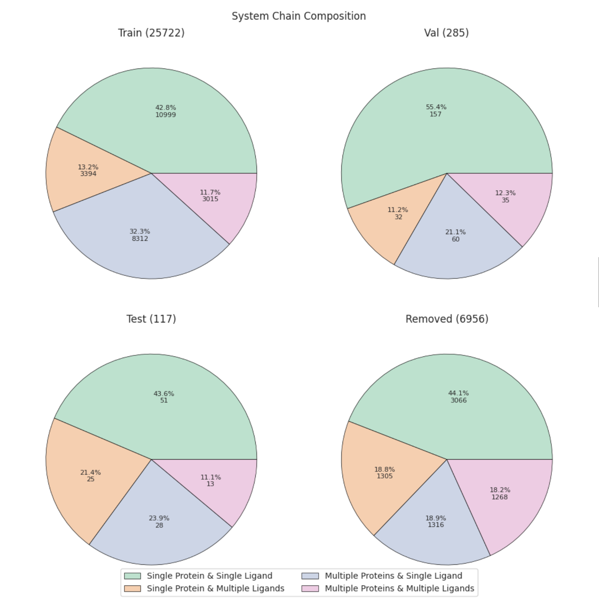
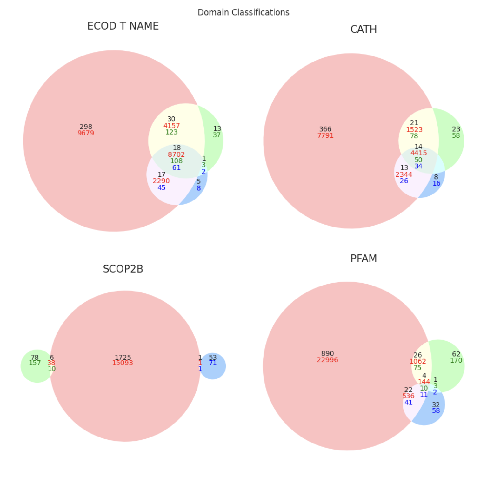
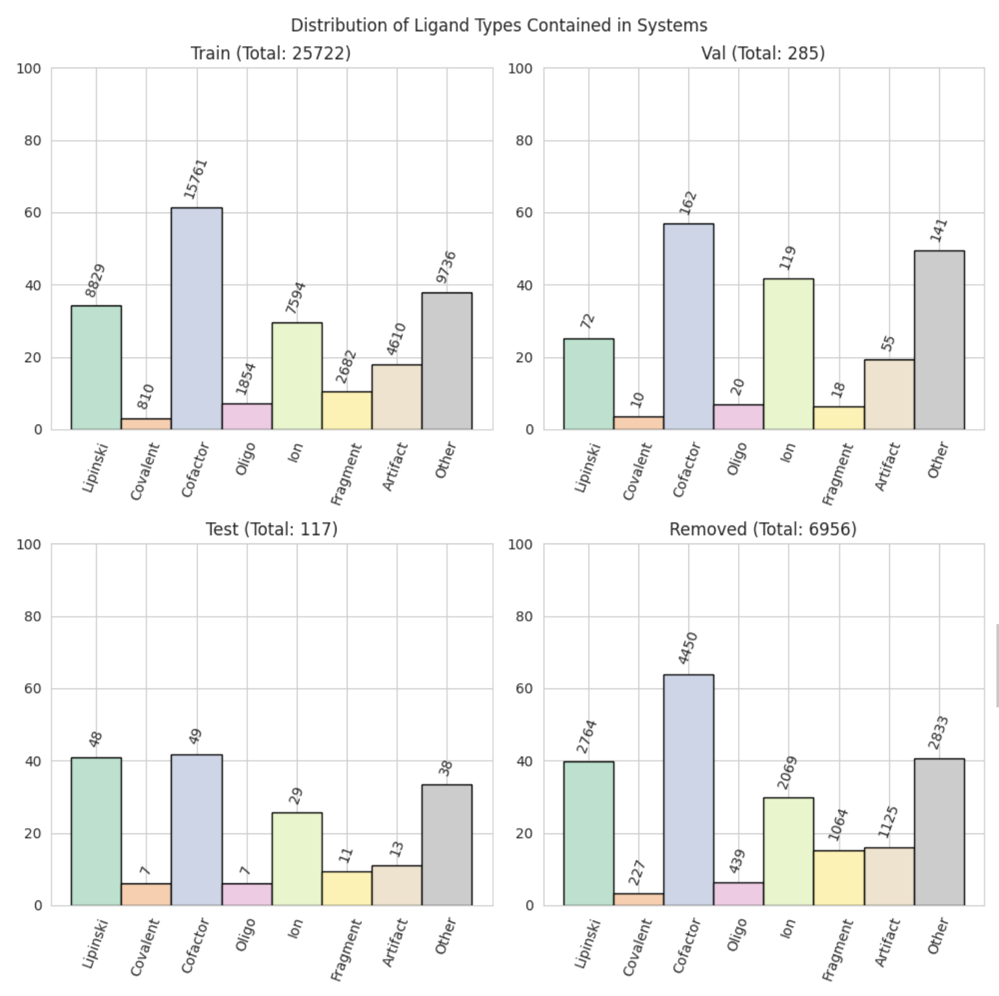
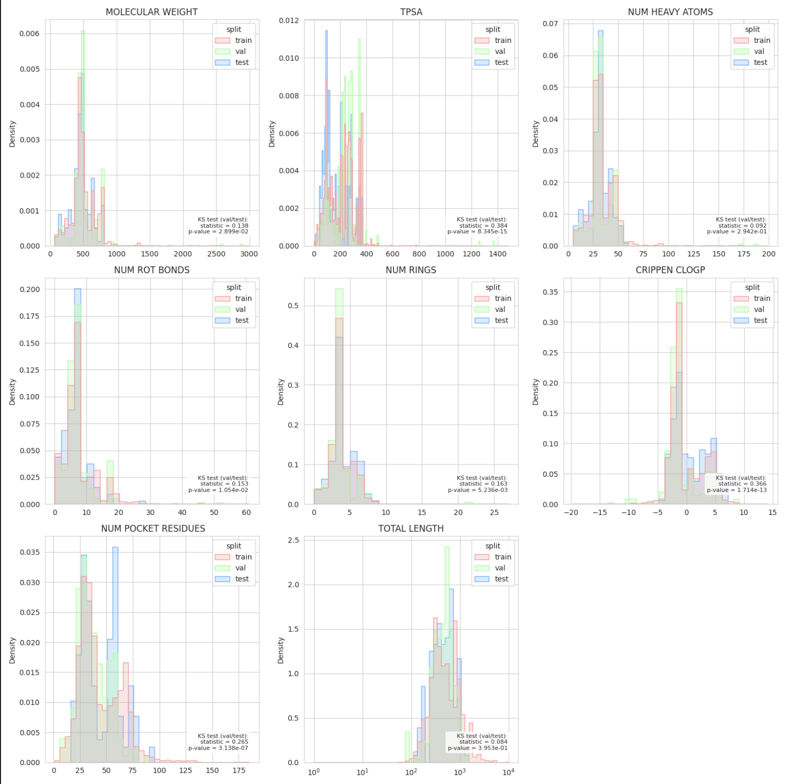
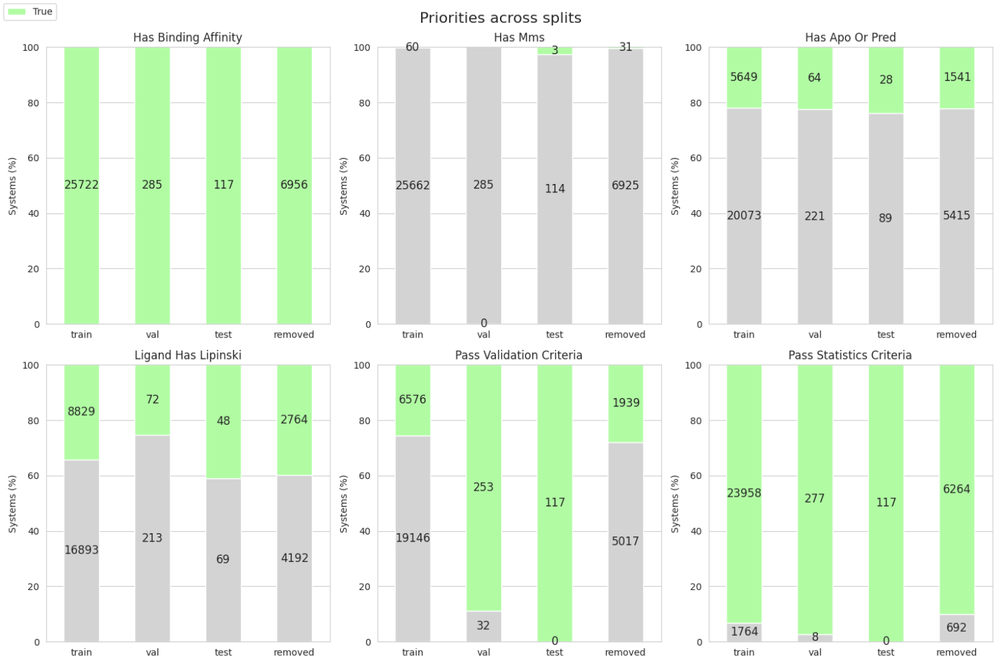
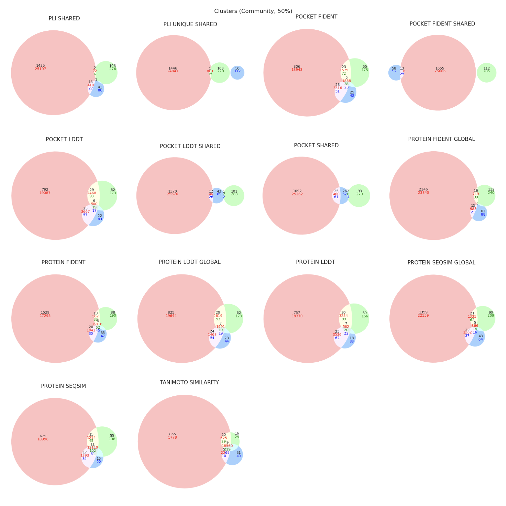

# Custom Split Example
Contributed by [Franz Görlich](https://github.com/frgoe003).

Import core libraries:
```python
from pathlib import Path

from plinder.data.splits import (
    split,
    get_default_config,
)
from plinder.core.scores import query_index
```

## Split Config

First, let's modify the split config. We will first get the default config using `get_default_config()` and then change some of the parameters.


```python
cfg = get_default_config()
print(f'Validation set size: {cfg.split.num_val}')
print(f'Test set size: {cfg.split.num_test}')
print(f'Minimum size of each cluster in the validation set: {cfg.split.min_val_cluster_size}')
```

    Validation set size: 1000
    Test set size: 1000
    Minimum size of each cluster in the validation set: 30


Since we reduced the total number of samples, let's also reduce the minimum validation set cluster size, so we avoid removing to many systems. <br> All configs can be found [here](https://plinder-org.github.io/plinder/dataset.html#splits-splits)


```python
cfg.split.num_test = 500 # Reduce the max size of the test set
cfg.split.num_val = 500 # Reduce the max size of the validation set
cfg.split.min_val_cluster_size = 5 # Reduce the minimum required size of each cluster in the validation set
```

## Custom Dataset

Let's generate a custom dataset that we want to resplit. First, let's load the plindex and then create a custom dataset.


```python
cols_of_interest = [
    "system_id",
    "entry_pdb_id",
    "ligand_ccd_code",
    "ligand_binding_affinity",
    "ligand_is_proper",
    "ligand_molecular_weight",
    "system_has_binding_affinity",
]
custom_df = query_index(
    columns=cols_of_interest, splits=["train", "val", "test", "removed"]
)
```

    2024-10-25 11:14:50,015 | plinder.core.utils.cpl.download_paths:24 | INFO : runtime succeeded: 0.53s
    2024-10-25 11:14:51,601 | plinder.core.utils.cpl.download_paths:24 | INFO : runtime succeeded: 0.55s


```python
custom_df.shape
```


    (567394, 8)


Let's filter every system out that doesn't have a binding affinity `system_has_binding_affinity`, ions and artifacts `ligand_is_proper` and ligands with a molecular weight of less than 400 g/mol `ligand_molecular_weight`.


```python
custom_df = custom_df[
    (custom_df["ligand_is_proper"] == True) &
    (custom_df["system_has_binding_affinity"] == True) &
    (custom_df["ligand_molecular_weight"] > 400)
]
custom_df.head(4)
```


<div>
<style scoped>
    .dataframe tbody tr th:only-of-type {
        vertical-align: middle;
    }

    .dataframe tbody tr th {
        vertical-align: top;
    }

    .dataframe thead th {
        text-align: right;
    }
</style>
<table border="1" class="dataframe">
  <thead>
    <tr style="text-align: right;">
      <th></th>
      <th>system_id</th>
      <th>entry_pdb_id</th>
      <th>ligand_ccd_code</th>
      <th>ligand_binding_affinity</th>
      <th>ligand_is_proper</th>
      <th>ligand_molecular_weight</th>
      <th>system_has_binding_affinity</th>
      <th>split</th>
    </tr>
  </thead>
  <tbody>
    <tr>
      <th>20</th>
      <td>2grt__1__1.A_2.A__1.C</td>
      <td>2grt</td>
      <td>GDS</td>
      <td>6.079633</td>
      <td>True</td>
      <td>612.151962</td>
      <td>True</td>
      <td>train</td>
    </tr>
    <tr>
      <th>22</th>
      <td>2grt__1__1.A_2.A__2.C</td>
      <td>2grt</td>
      <td>GDS</td>
      <td>6.079633</td>
      <td>True</td>
      <td>612.151962</td>
      <td>True</td>
      <td>train</td>
    </tr>
    <tr>
      <th>74</th>
      <td>8gr9__1__1.A_1.B__1.C_1.J</td>
      <td>8gr9</td>
      <td>COA</td>
      <td>5.465907</td>
      <td>True</td>
      <td>767.115209</td>
      <td>True</td>
      <td>removed</td>
    </tr>
    <tr>
      <th>85</th>
      <td>1grn__1__1.A_1.B__1.C_1.D_1.E</td>
      <td>1grn</td>
      <td>GDP</td>
      <td>3.428291</td>
      <td>True</td>
      <td>443.024330</td>
      <td>True</td>
      <td>train</td>
    </tr>
  </tbody>
</table>
</div>


```python
custom_df.shape
```


    (36247, 8)


```python
custom_df['split'].value_counts()
```


    split
    train      25610
    removed    10483
    val           92
    test          62
    Name: count, dtype: int64


## Resplitting the Dataset

We see that we end up with only 92 systems in our validation set and 62 in our test set. We also have over 10k removed systems. Let's resplit the dataset and see how the new split looks like.

__NOTE__: resplitting the dataset requires a lot of memory and might only be feasible on a HPC cluster.


```python
data_dir = Path("~/.local/share/plinder/2024-06/v2")
custom_systems = set(custom_df['system_id'].unique())
split_name = 'custom_1'

new_split_df = split(
    data_dir=data_dir,
    cfg=cfg, # here we use the modified config from earlier
    relpath=split_name,
    selected_systems=custom_systems
)
new_split_df.shape
```


    (33047, 13)


```python
new_split_df.head(4)
```


<div>
<style scoped>
    .dataframe tbody tr th:only-of-type {
        vertical-align: middle;
    }

    .dataframe tbody tr th {
        vertical-align: top;
    }

    .dataframe thead th {
        text-align: right;
    }
</style>
<table border="1" class="dataframe">
  <thead>
    <tr style="text-align: right;">
      <th></th>
      <th>system_id</th>
      <th>uniqueness</th>
      <th>split</th>
      <th>cluster</th>
      <th>cluster_for_val_split</th>
      <th>system_pass_validation_criteria</th>
      <th>system_pass_statistics_criteria</th>
      <th>system_proper_num_ligand_chains</th>
      <th>system_proper_num_pocket_residues</th>
      <th>system_proper_num_interactions</th>
      <th>system_proper_ligand_max_molecular_weight</th>
      <th>system_has_binding_affinity</th>
      <th>system_has_apo_or_pred</th>
    </tr>
  </thead>
  <tbody>
    <tr>
      <th>0</th>
      <td>10gs__1__1.A_1.B__1.C</td>
      <td>10gs__A_B__C_c101993</td>
      <td>train</td>
      <td>c62</td>
      <td>c0</td>
      <td>True</td>
      <td>True</td>
      <td>1</td>
      <td>24</td>
      <td>15</td>
      <td>473.162057</td>
      <td>True</td>
      <td>False</td>
    </tr>
    <tr>
      <th>1</th>
      <td>10gs__1__1.A_1.B__1.E</td>
      <td>10gs__A_B__E_c101949</td>
      <td>train</td>
      <td>c62</td>
      <td>c0</td>
      <td>True</td>
      <td>True</td>
      <td>1</td>
      <td>24</td>
      <td>13</td>
      <td>473.162057</td>
      <td>True</td>
      <td>False</td>
    </tr>
    <tr>
      <th>2</th>
      <td>19gs__1__1.A_1.B__1.C_1.D</td>
      <td>19gs__A_B__C_D_c147080</td>
      <td>train</td>
      <td>c62</td>
      <td>c0</td>
      <td>False</td>
      <td>True</td>
      <td>2</td>
      <td>30</td>
      <td>12</td>
      <td>787.630334</td>
      <td>True</td>
      <td>False</td>
    </tr>
    <tr>
      <th>3</th>
      <td>19gs__1__1.A_1.B__1.F_1.G</td>
      <td>19gs__A_B__F_G_c101954</td>
      <td>train</td>
      <td>c62</td>
      <td>c0</td>
      <td>False</td>
      <td>True</td>
      <td>2</td>
      <td>30</td>
      <td>14</td>
      <td>787.630334</td>
      <td>True</td>
      <td>False</td>
    </tr>
  </tbody>
</table>
</div>


## Visualizing the new Split

Now that we have our first custom split, let's use the `SplitPropertiesPlotter` to visualize the new split.


```python
from plinder.core.split.plot import SplitPropertiesPlotter
```


```python
plotter = SplitPropertiesPlotter.from_files(
    data_dir = Path('~/.local/share/plinder/2024-06/v2'),
    split_file = Path(f'~/.local/share/plinder/2024-06/v2/splits/split_{split_name}.parquet'),
)
```

This will create a folder `split_plots` in the current working directory with the following plots:

`split_plots/split_proportions.png`



`split_plots/chain_composition.png`


`split_plots/domain_classifications.png`



`split_plots/ligand_types.png`



`split_plots/molecular_descriptors.png`



`split_plots/priorities.png`



`split_plots/plinder_clusters.png`


